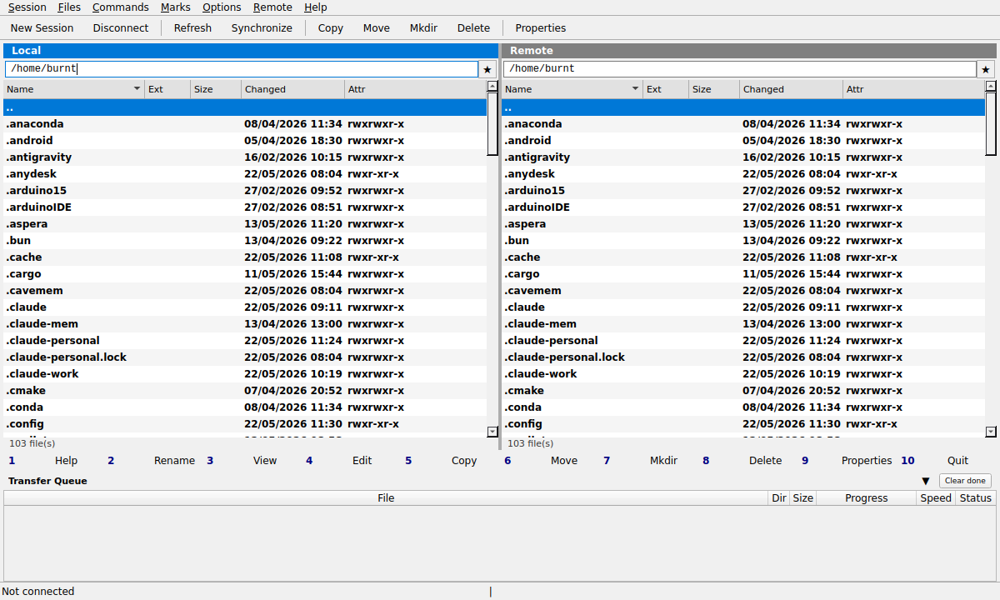

# LinuxSCP

A WinSCP-compatible SFTP/SCP/FTP client for Linux, built with Python and PyQt6.



## Features

- **Dual-pane Commander interface** — local and remote panels side by side, just like WinSCP
- **SFTP / SCP / FTP / FTPS** support via paramiko and ftplib
- **Integrated SSH terminal** — opens a shell to the connected server in one click
- **File operations** — copy (F5), move (F6), mkdir (F7), delete (F8), rename (F2)
- **View & edit** — F3 opens files read-only, F4 / double-click opens with your system default editor (e.g. VS Code); remote files are downloaded, watched for changes and auto-uploaded on save
- **Directory synchronisation** — compare local ↔ remote and apply selected actions
- **Transfer queue** — real-time progress for all ongoing transfers
- **Bookmarks** — star any directory in the path bar to bookmark it
- **Drag & drop** — drag files between panels to copy them
- **Preferences** — theme, font, hidden files, confirm-on-delete, transfer options, editor override
- **Dark-theme safe** — explicit colours throughout; works on any GTK/KDE theme

## Requirements

- Python 3.12+
- PyQt6 ≥ 6.6.0
- paramiko ≥ 3.4.0
- ftputil ≥ 5.0.4
- webdavclient3 ≥ 3.14.6

## Installation

```bash
git clone https://github.com/youruser/LinuxSCP.git
cd LinuxSCP
pip install -r requirements.txt
python main.py
```

With a virtual environment:

```bash
python -m venv .venv
source .venv/bin/activate
pip install -r requirements.txt
python main.py
```

## Usage

LinuxSCP opens the **Site Manager** on startup. Add a connection, press **Login** and you're in.

| Key | Action |
|-----|--------|
| F2 | Rename |
| F3 | View file |
| F4 / double-click | Open file with system default editor |
| F5 | Copy |
| F6 | Move |
| F7 | Create directory |
| F8 | Delete |
| F9 | Properties |
| F10 | Quit |
| Ctrl+T | Open SSH terminal to connected server |
| Ctrl+R | Refresh active panel |
| Ctrl+N | New session (Site Manager) |
| Ctrl+D | Disconnect |
| Tab | Switch active panel |
| Backspace | Go to parent directory |

### Editing remote files

Double-click (or F4) on a remote file downloads it to a temporary location and opens it with `xdg-open` — so it uses whatever editor your system has set as default (VS Code, gedit, etc.). Every time you save in your editor, LinuxSCP detects the change and uploads the file back to the server automatically.

To force a specific editor, go to **Options → Preferences → Editor** and enable *Use external editor*, then set the command (e.g. `code %f` for VS Code, `gedit %f` for gedit).

### SSH Terminal

Once connected, click **⬛ Terminal** in the toolbar (or Ctrl+T) to open an embedded shell session to the remote server. The terminal supports ANSI colours and command history (↑/↓).

## Project structure

```
LinuxSCP/
├── main.py                  # Entry point
├── requirements.txt
└── linuxscp/
    ├── core/
    │   ├── base_session.py  # Abstract session interface
    │   ├── local_session.py # Local filesystem session
    │   ├── sftp_session.py  # SFTP/SCP via paramiko
    │   ├── ftp_session.py   # FTP/FTPS via ftplib
    │   ├── local_fs.py      # FileEntry dataclass + directory listing
    │   ├── transfer.py      # Transfer jobs + worker thread
    │   ├── sync.py          # Directory comparison + sync
    │   ├── connect_worker.py# Async connection worker
    │   ├── config_store.py  # Session + bookmark persistence
    │   └── preferences.py   # Application preferences
    └── ui/
        ├── main_window.py   # Main window + orchestration
        ├── file_panel.py    # Dual-pane file list
        ├── site_manager.py  # Connection manager dialog
        ├── terminal.py      # Embedded SSH/local terminal
        ├── transfer_queue.py# Transfer progress panel
        ├── sync_dialog.py   # Synchronise dialog
        ├── viewer.py        # F3 file viewer
        ├── editor.py        # Built-in text editor (fallback)
        ├── preferences_dialog.py
        ├── copy_dialog.py
        ├── rename_dialog.py
        ├── password_dialog.py
        ├── fkeys_bar.py     # F1–F10 bar
        └── styles.py        # Qt stylesheets
```

## Configuration

All configuration is stored in `~/.config/linuxscp/`:

| File | Contents |
|------|----------|
| `sessions.json` | Saved connections |
| `bookmarks.json` | Directory bookmarks |
| `preferences.json` | Application preferences |

## License

MIT
